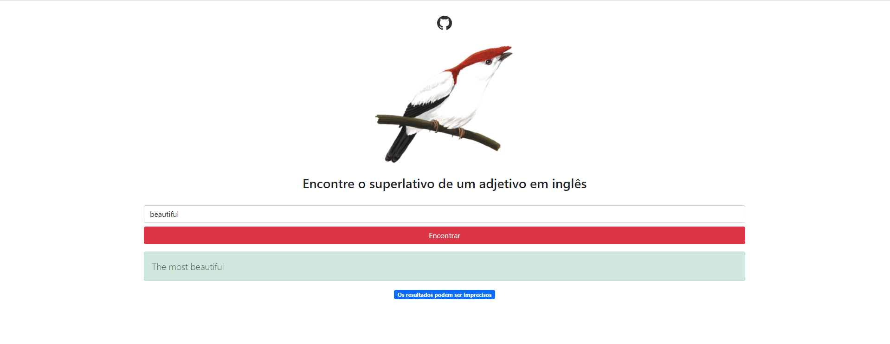

## Encontre o superlativo de um adjetivo em inglês :nerd_face: :computer:

### Como startar o projeto :runner:
1. - [x] Instale todas as dependências com o comando ``` npm install ```
2.  - [x] Use ``` npm run serve ``` para startar o projeto 
### Tarefas :bookmark_tabs: 
- [x] Criar o projeto com Vue-CLI 
- [x] Consumir a [API](https://api.dictionaryapi.dev/api/v2/entries/en_US/:adjective) de dicionário
- [x] Contar a quantidade de sílabas com a dependência [Syllable](https://www.npmjs.com/package/syllable)
- [x] Criar as regras